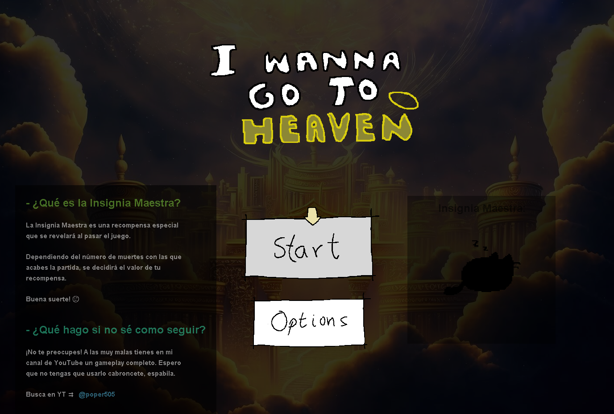
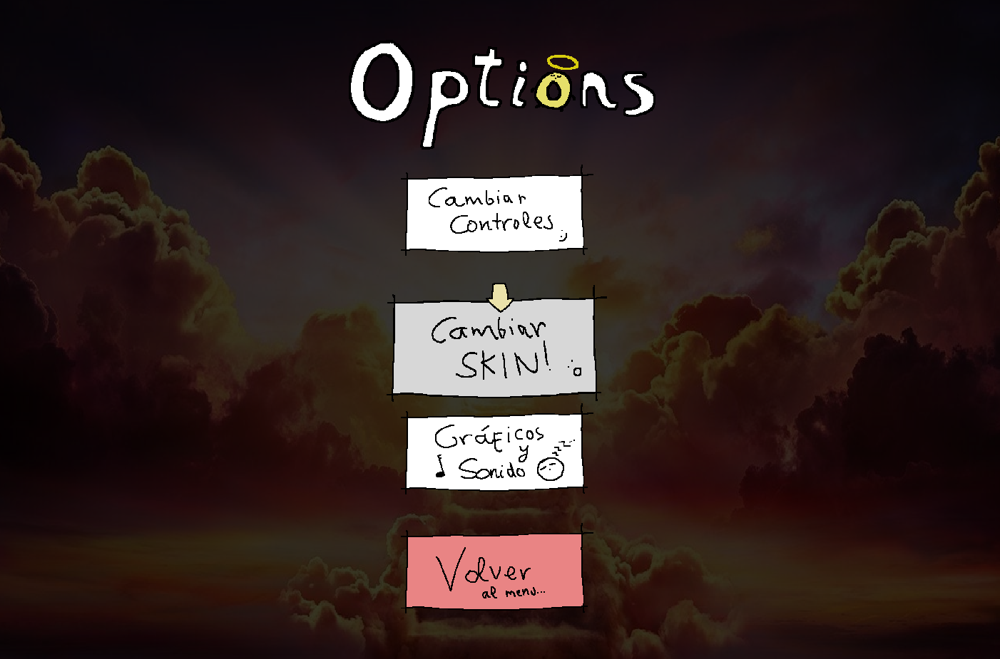
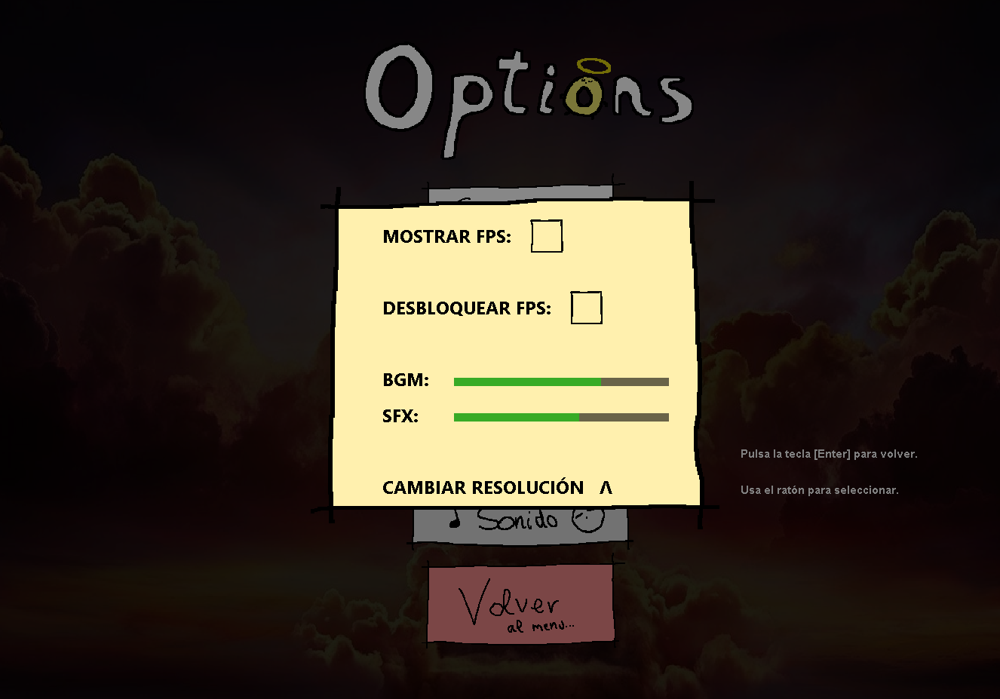
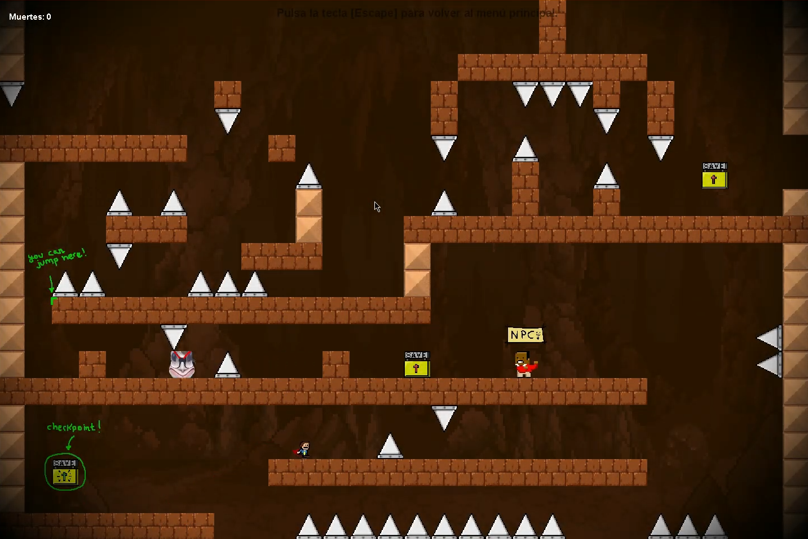
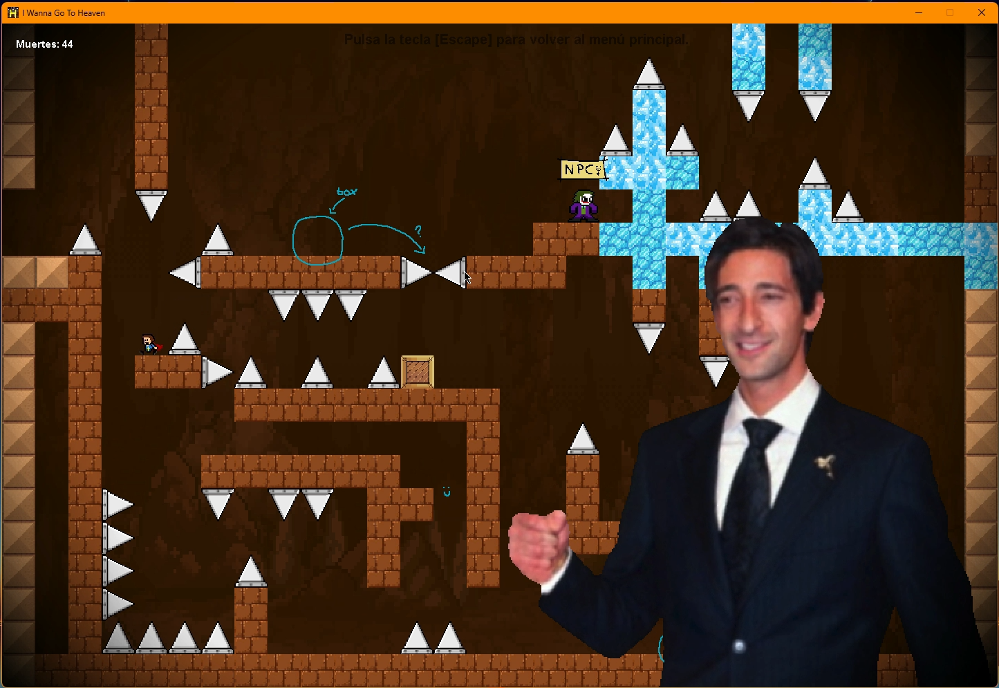
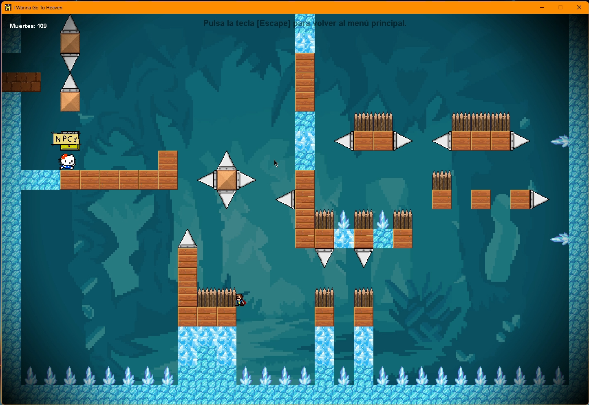
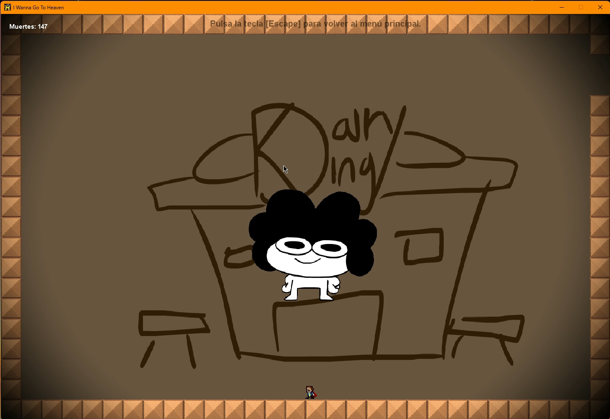
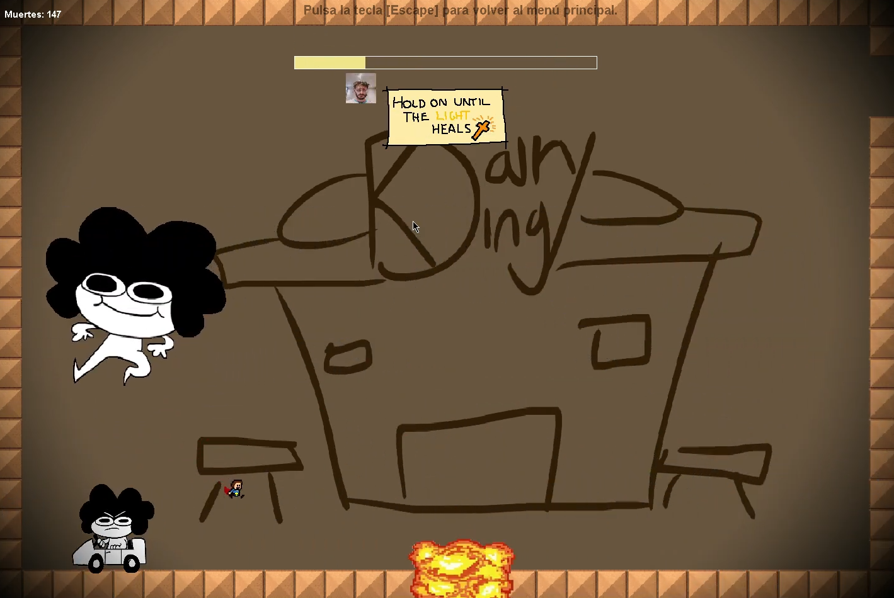

<h1 align="center">I Wanna Go To Heaven: <br> Java-Made 2D Hard Platformer</h1>
<p align="center"><a href="#project-description">Project Description</a> - <a href="#features">Features</a> - <a href="#tech-stack">Tech Stack</a> - <a href="#installation">Installation</a> - <a href="#screenshots">Screenshots</a></p>

<p align="center">
  
</p>

## Project Description:

<p>I Wanna Go To Heaven is a challenging 2D platformer inspired by the classic I Wanna Be The Guy, a game known for its extreme difficulty.
This project was mainly a personal experiment to practice pure Java game development, built entirely using internal Java libraries without external engines or frameworks.

Although it’s an older project and some design choices might not be ideal by today’s standards, it includes several interesting mechanics:</p>

## Features:
<ul>
<li>Double-jump physics</li>
<li>Enemies and deadly spikes</li>
<li>Physics-based crate</li>
<li>NPCs with branching dialogue trees</li>
<li>Humorous references to friends and internet classics</li>
<li>A final boss inspired by SrPelo, a well-known online animator</li>
</ul>

<p>Visuals are intentionally quirky and textures are simple but give the game personality :P</p>

<p><em>Note:</em> This was a learning project, so some patterns and implementations may not follow modern best practices.</p>

## Tech Stack:
<ul style="text-align: left; display: inline-block;">
  <li>Languages: Java.</li>
  <li>Libraries: Swing (GUI), AWT (2D graphics), javax.sound.sampled (sound)</li>
  <li>Tools: Git, NetBeans</li>
</ul>

## Installation:
1. Clone the repository:
```bash 
  git clone https://github.com/danielblazquez916/i-wanna-go-to-heaven-java.git
```
2. Open NetBeans and select File → Open Project.
3. Navigate to the cloned folder and open the project.
4. Compile and run the project by clicking the Run button or pressing <kbd>F6</kbd>.

- Note: Make sure you have Java JDK installed (version 8 or higher recommended).

## Screenshots:
<p align="center">   </p> <p align="center">   </p> <p align="center">   </p> <p align="center">   </p>
